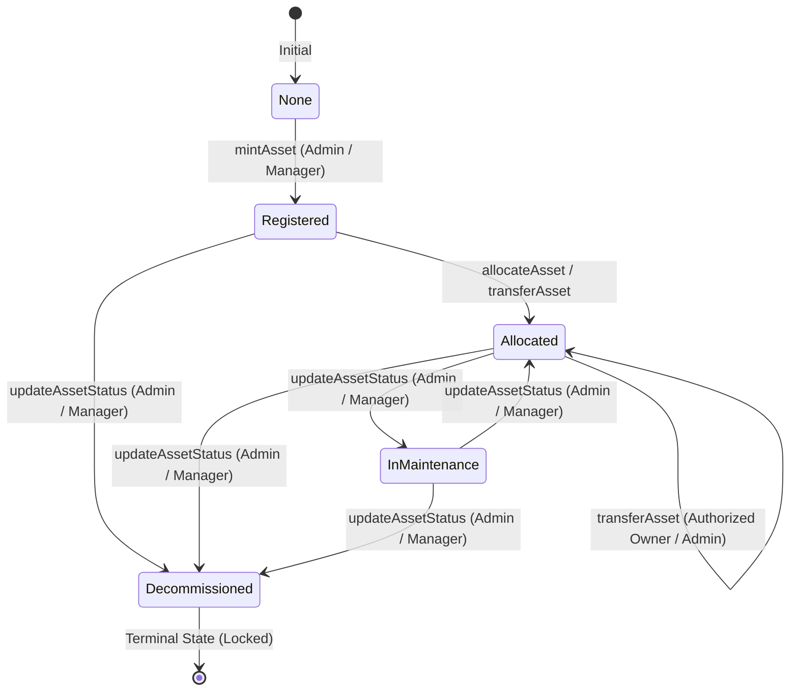

# Asset NFT Specification & Data Model
**Module**: Person 4 — NFT + Asset Management Engineer  
**Standard**: ERC-721 (OpenZeppelin `ERC721URIStorage`, `Pausable`, `ReentrancyGuard`)  
**Status**: Implemented & Verified

---

## 1. Overview & Project Purpose
This module represents organizational assets as verifiable ERC-721 non-fungible tokens on-chain. It establishes an immutable link between an organizational asset, its cryptographic custodian/owner DID, its metadata specifications, and its lifecycle status.

---

## 2. Authenticity Limitation & Architectural Scope

> [!IMPORTANT]
> **Authenticity Principle**: An on-chain NFT is a cryptographic representation of an organizational asset and its authorized custody trail. It does **NOT** automatically prove that a real-world physical object is genuine. Real-world authenticity is established off-chain through authorized organizational inspections and verified intake procedures prior to on-chain minting.

```
Real-World Verification (OFF-CHAIN)
              ↓
Authorized Registration (Admin / Manager)
              ↓
ERC-721 NFT Minted & Bound to DID
              ↓
Immutable Custody & Audit Trail on Blockchain
```

---

## 3. Asset Data Model

### 3.1 On-Chain Asset Record (`AssetRecord`)

```solidity
enum AssetStatus {
    None,           // 0: Unregistered / Non-existent
    Registered,     // 1: Minted into organization inventory
    Allocated,      // 2: Assigned to active custodian / department
    InMaintenance,  // 3: Temporarily locked for maintenance / audit
    Decommissioned  // 4: Permanently retired / destroyed (terminal state)
}

struct AssetRecord {
    uint256 tokenId;        // Unique ERC-721 Token ID
    string assetId;         // Organization asset code (e.g. "AST-HW-2026-001")
    string assetType;       // Category (e.g. "HARDWARE", "LICENSE", "VEHICLE")
    string assetReference;  // Hash / Digest of off-chain specification document
    string metadataURI;     // Off-chain metadata URI (IPFS / HTTPS)
    address currentOwner;   // Current token holder wallet address
    string ownerDid;        // DID of the current owner/custodian
    AssetStatus status;     // Current lifecycle status
    uint256 createdAt;      // Mint timestamp
    uint256 updatedAt;      // Last update / transfer timestamp
}
```

### 3.2 Privacy & Zero-PII Guarantee
| Field | Storage Location | Privacy Classification |
| :--- | :--- | :--- |
| **`tokenId`** | On-Chain | Public Identifier |
| **`assetId`** | On-Chain | Public Organization Code |
| **`assetType`** | On-Chain | Public Categorization |
| **`assetReference`** | On-Chain | Cryptographic Reference / Digest |
| **`metadataURI`** | On-Chain | Public / IPFS Reference URI |
| **`currentOwner`** | On-Chain | Public Ethereum Address |
| **`ownerDid`** | On-Chain | Public DID Reference |
| **`status`** | On-Chain | Public Lifecycle Enum |
| **Employee Name / PII** | **Off-Chain Database Only** | Sensitive PII (NEVER ON-CHAIN) |
| **Government IDs / Docs**| **Off-Chain Database Only** | Highly Sensitive PII (NEVER ON-CHAIN) |

---

## 4. Asset Lifecycle State Machine



1. **Registered**: The asset has been inspected, approved, and minted into inventory.
2. **Allocated**: The asset is actively assigned to an employee or department DID.
3. **InMaintenance**: The asset is temporarily unavailable; transfers and allocations are blocked.
4. **Decommissioned**: The asset is retired, discarded, or destroyed. All transfers and allocations are permanently prevented.
