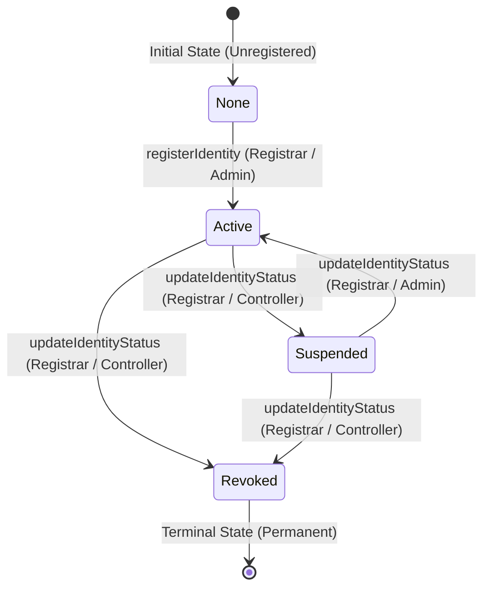

# Decentralized Identity (DID) Specification & Data Model
**Module**: Person 2 — DID + Decentralized Identity Engineer  
**Status**: Implemented & Verified  
**Method Name**: `did:assetchain`

---

## 1. Overview & Prototype Scope
This specification defines the prototype Decentralized Identifier (DID) method and public-key identity registry designed for the **Blockchain-Based Decentralized Identity, RBAC, and NFT Asset Ownership Platform**.

> [!NOTE]
> This is a project prototype DID representation (`did:assetchain:<identifier>`) built for academic/hackathon purposes. It is tailored to integrate with off-chain KYC verification and on-chain RBAC/NFT authorization without claiming complete W3C DID method registration.

---

## 2. DID Syntax & Format

```
did:assetchain:<unique-identifier>
```

### Format Rules:
1. **Scheme**: `did` (fixed lower case)
2. **Method**: `assetchain` (fixed lower case)
3. **Method-Specific Identifier**: A unique string containing alphanumeric characters and hyphens.
   - Example 1: `did:assetchain:usr-1001-alice-7f8a9b`
   - Example 2: `did:assetchain:org-sec-c8d32e1`
   - Length: Between 16 and 128 characters.
   - Prefix match: Must start with `did:assetchain:`.

---

## 3. Data Model & Boundary

### 3.1 On-Chain Identity Record (`IdentityRecord`)
The on-chain smart contract (`IdentityRegistry.sol`) stores only cryptographic identifiers, controller addresses, status flags, and timestamps:

```solidity
struct IdentityRecord {
    string did;             // Unique identifier (did:assetchain:<id>)
    bytes publicKey;        // Cryptographic public key bytes
    address controller;     // Ethereum address authorized to control/represent this DID
    IdentityStatus status;  // Active (1), Suspended (2), Revoked (3)
    uint256 registeredAt;   // Registration timestamp (block.timestamp)
    uint256 updatedAt;      // Last update timestamp
}
```

### 3.2 Strict Privacy & Zero-PII Guarantee
| Data Field | Storage Location | Privacy Classification |
| :--- | :--- | :--- |
| **DID** | On-Chain + Off-Chain | Public Identifier |
| **Public Key** | On-Chain + Off-Chain | Public Cryptographic Credential |
| **Controller Address** | On-Chain + Off-Chain | Public Account Address |
| **Identity Status** | On-Chain + Off-Chain | Public Verification Status |
| **Full Name** | **Off-Chain Only (Person 1 KYC DB)** | Sensitive PII (NEVER ON-CHAIN) |
| **Email / Phone** | **Off-Chain Only (Person 1 KYC DB)** | Sensitive PII (NEVER ON-CHAIN) |
| **Government ID / Docs**| **Off-Chain Only (Person 1 KYC DB)** | Highly Sensitive PII (NEVER ON-CHAIN)|
| **Password / Private Key**| **Client-side / Never Sent to Server**| Secret Credential (NEVER EXPOSED) |

---

## 4. Identity Lifecycle State Machine



1. **None (0)**: Identity is unregistered.
2. **Active (1)**: Identity is verified, valid, and authorized for role assignment and asset operations.
3. **Suspended (2)**: Temporarily disabled (e.g., during investigation or key recovery). Cannot execute asset operations or key updates.
4. **Revoked (3)**: Permanently invalidated (e.g., severe key breach or user decommission). Re-activation is strictly prohibited by smart contract logic.

---

## 5. Public Key & Controller Management
- **Public Key Rotation**: Allowed only while the identity is in `Active` status. Can be initiated by the identity `controller` or authorized `REGISTRAR_ROLE`.
- **Controller Rotation**: Allows transferring the representation address to a new wallet address. Reverts if the destination address is already bound to another DID.
